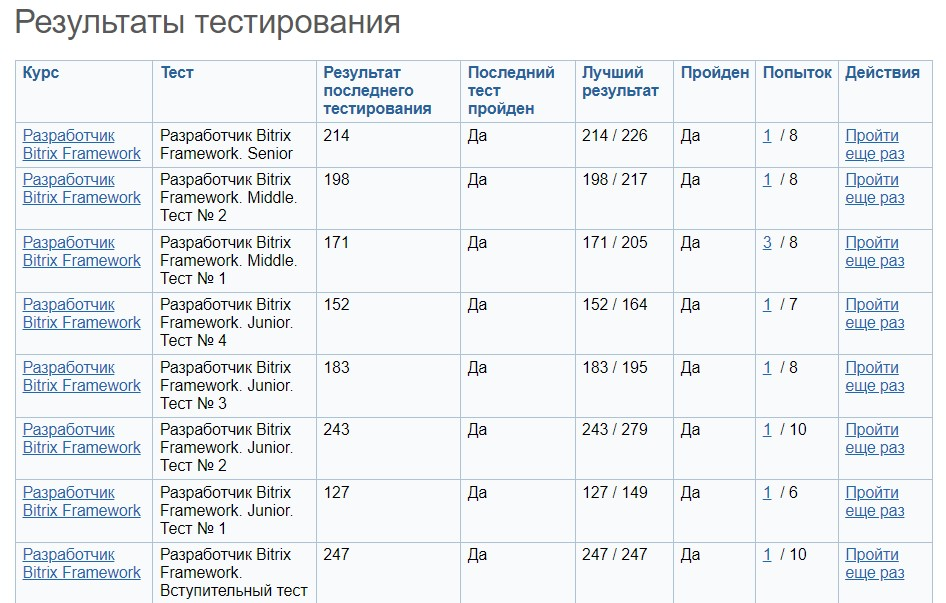
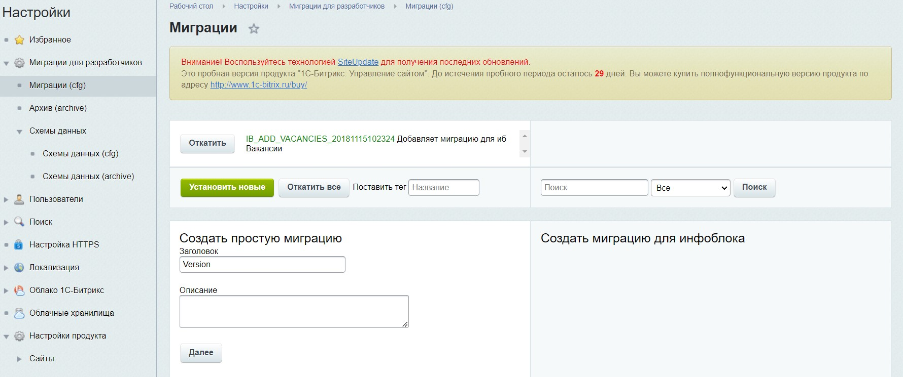
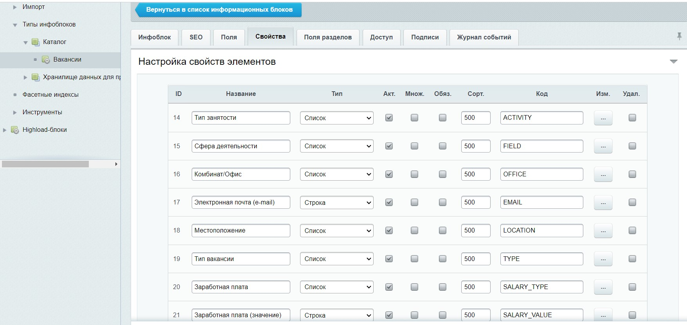
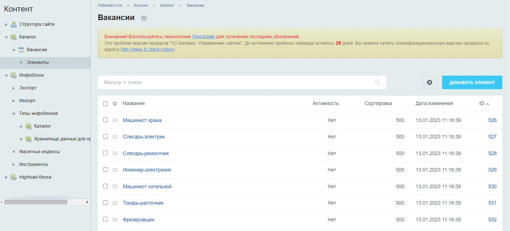
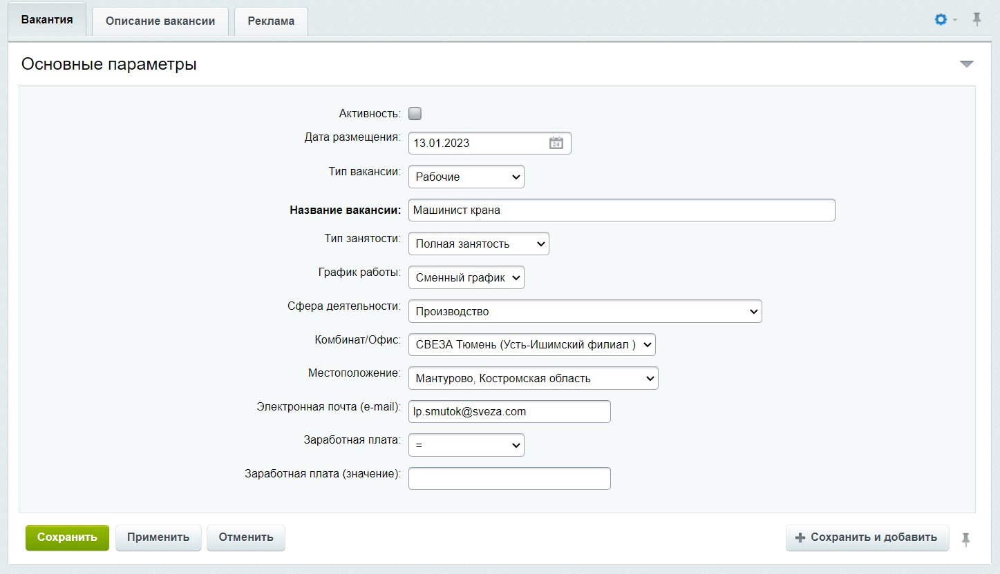
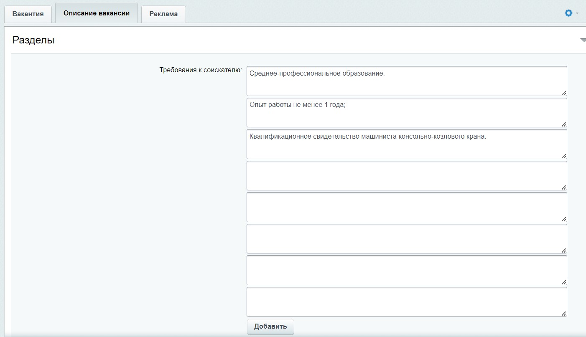

# Курсы на неделю:
Разработчик Bitrix Framework	https://dev.1c-bitrix.ru/learning/course/index.php?COURSE_ID=43  

Если останется время: stepik: курс Web-разработка	https://stepik.org/course/4006/syllabus  

# Задачи:
Сдать тесты в кусе pазработчик  

Установить модуль миграций и миграцию(создаст инфоблок)  

Написать парсер, 

    Файл: index.php

Заполняющий иноблок элементами (Дополнительно) 

Парсер должен автоматически заполнять значения свойств типа "Список"

